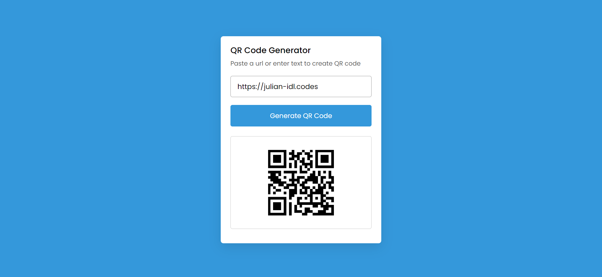
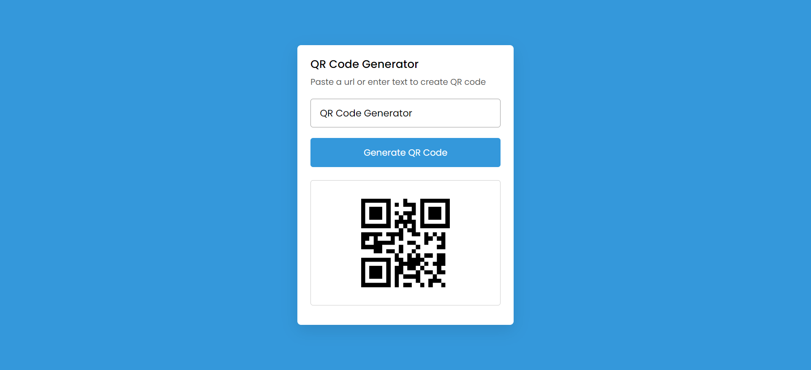

## QR Code Generator

<p align = "center"></p>

Simple Yet Powerful QR Code Generator


## Set-Up ⚒️

<p align = "center"></p>

- Ensure you have the latest stable version of [Node.js](https://nodejs.dev/en/learn/how-to-install-nodejs/) in your system

- Open your terminal / command prompt

- Clone the repository 
    ```
    git clone https://github.com/Julian-Idl/QR-Code-Generator.git
    ```
- Change the directory to the cloned project
    
    ```
    cd QR-Code-Generator
    ```
- Open a localhost server **(preferably port:3000)**

- Open a browser of your choice and navigate to  `http://localhost:3000`

- To stop the application, press `CTRL + C` in your terminal / command prompt

## Demo 👇

**v.0.0.1**


<p align = "center"></p>

**v.0.0.1** (Sample URL)
<p align = "center"></p>

**v.0.0.1** (Sample Text)
<p align = "center"></p>

**Click [Here](http://qr-code-generator.julianidl.repl.co/) For Live Demo**

## Note ✏️

- Feel free to contact me in my  [](https://julian-idl.codes)

## Author

Made with ♥ by [Julian-Idl](julian-idl.codes)